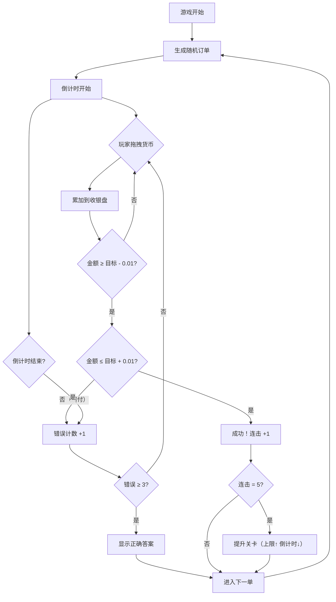
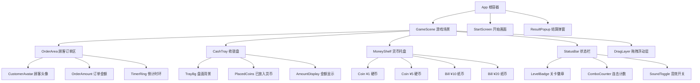

## 1. 产品概述

「我是小小收银员」是一款面向门店等候区平板的轻量级教育游戏，让孩子通过拖拽硬币与纸币组合凑出应付金额，锻炼数学心算能力。家长在等待时愿意多停留，门店提升客户体验与停留时长。

- 目标用户：3–10 岁儿童（家长陪伴），门店等候区场景
- 核心价值：寓教于乐，降低等候焦虑，提升门店服务感知

## 2. 核心功能

### 2.1 用户角色

| 角色 | 注册方式 | 核心权限 |
|------|----------|----------|
| 儿童（玩家） | 无需注册 | 拖拽硬币/纸币、通关、查看提示 |
| 家长（旁观） | 无需注册 | 音效开关、重新开始 |

### 2.2 功能模块

1. **游戏主界面**：顾客订单显示、倒计时、收银盘、货币托盘、计分板
2. **关卡系统**：难度递增（订单上限提升 + 倒计时缩短）
3. **拖拽交互**：触摸拖拽货币至收银盘，累加金额
4. **音效系统**：叮咚、成功、失败音效，开关记忆在 localStorage
5. **结算反馈**：成功动画、失败提示（三次错误显示正确答案）

### 2.3 页面详情

| 页面名称 | 模块名称 | 功能描述 |
|----------|----------|----------|
| 游戏主界面 | 顾客订单区 | 随机显示 1–99 元订单，含顾客头像与商品图标 |
| 游戏主界面 | 收银盘区 | 拖拽目标区，实时显示已放入金额与差额 |
| 游戏主界面 | 货币托盘区 | 1/5/10/20 元硬币与纸币，可重复拖拽 |
| 游戏主界面 | 状态栏 | 倒计时、连击数、关卡等级、音效开关 |
| 游戏主界面 | 结算弹窗 | 成功/失败动画、正确答案展示、下一单按钮 |

## 3. 核心流程

玩家进入游戏 → 系统生成随机订单 → 倒计时开始 → 玩家从托盘拖拽货币至收银盘 → 系统累加金额 → 判断是否达到目标（±0.01）→ 成功则连击+1，五连击提升关卡 → 失败则错误计数+1，三次错误展示正确答案 → 进入下一单

## 4. 用户界面设计

### 4.1 设计风格

- **主色调**：暖橙色（#FF8C42）+ 薄荷绿（#2EC4B6），营造活泼温馨的儿童风格
- **辅助色**：奶油白（#FFF8E7）背景、深棕色（#3D2C2E）文字
- **按钮风格**：圆角大按钮，3D 立体感，适合触摸操作
- **字体**：圆润可爱的手写风字体（如 ZCOOL KuaiLe），大号数字
- **布局风格**：竖屏适配，上方订单 → 中间收银盘 → 下方货币托盘
- **图标/表情**：卡通风格顾客头像、硬币/纸币拟物化设计

### 4.2 页面设计概览

| 页面名称 | 模块名称 | UI 元素 |
|----------|----------|---------|
| 游戏主界面 | 顾客订单区 | 卡通顾客头像 + 商品图标 + 大号金额数字 + 倒计时环形进度条 |
| 游戏主界面 | 收银盘区 | 木质纹理收银盘 + 已放入货币缩略图 + 差额提示 |
| 游戏主界面 | 货币托盘区 | 4 种面额硬币/纸币排列 + 无限拖拽 + 放置回弹动画 |
| 游戏主界面 | 状态栏 | 连击火焰图标 + 关卡星星 + 音效喇叭按钮 |
| 游戏主界面 | 结算弹窗 | 星星飞散/红叉动画 + 金额对比 + 下一单按钮 |

### 4.3 响应式适配

- **竖屏优先**：设计基准 768×1024（iPad Mini 竖屏）
- **触摸优化**：所有交互元素最小 44px 触摸区域，拖拽容差宽松
- **横屏锁定**：CSS + JS 检测横屏时提示旋转设备

### 4.4 关卡参数表

| 关卡等级 | 订单金额范围（元） | 倒计时（秒） | 连击提升条件 | 错误上限 |
|----------|---------------------|---------------|--------------|----------|
| 1 | 1–10 | 30 | 5 连击 | 3 |
| 2 | 1–30 | 25 | 5 连击 | 3 |
| 3 | 1–50 | 20 | 5 连击 | 3 |
| 4 | 1–70 | 18 | 5 连击 | 3 |
| 5 | 1–99 | 15 | 5 连击 | 3 |
| 6+ | 1–99 | 12 | 5 连击 | 3 |

### 4.5 对象层级图

