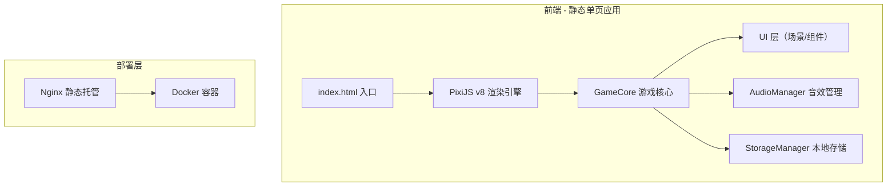

## 1. 架构设计



纯前端静态应用，无后端服务。通过 Docker + Nginx 进行静态托管。

## 2. 技术说明

- **前端引擎**：PixiJS v8（2D WebGL 渲染）
- **构建工具**：Vite 5
- **包管理**：npm
- **音效**：Web Audio API（通过 PixiJS Sound 插件或原生 Audio）
- **本地存储**：localStorage（音效开关等偏好）
- **部署**：Docker + Nginx 静态托管，docker-compose 一键启动
- **无后端**：所有逻辑前端完成

## 3. 路由定义

| 路由 | 用途 |
|------|------|
| / | 游戏主页面（单页应用，无路由切换） |

## 4. 项目文件结构

```
cashier-game/
├── index.html                  # 入口 HTML
├── package.json                # 依赖配置
├── vite.config.js              # Vite 构建配置
├── Dockerfile                  # Docker 镜像
├── docker-compose.yml          # 一键启动
├── nginx.conf                  # Nginx 配置
├── src/
│   ├── main.js                 # 入口：初始化 PixiJS 应用
│   ├── config/
│   │   └── denominations.js    # 面额配置（新增面额只需修改此文件）
│   ├── core/
│   │   ├── Game.js             # 游戏主控制器
│   │   ├── LevelManager.js     # 关卡与难度管理
│   │   ├── DragManager.js      # 拖拽交互管理
│   │   └── ScoreManager.js     # 计分与连击管理
│   ├── scenes/
│   │   ├── StartScene.js       # 开始画面
│   │   └── GameScene.js        # 游戏主场景
│   ├── components/
│   │   ├── OrderArea.js        # 顾客订单区
│   │   ├── CashTray.js         # 收银盘
│   │   ├── MoneyShelf.js       # 货币托盘
│   │   ├── MoneyItem.js        # 单个货币（硬币/纸币）
│   │   ├── StatusBar.js        # 状态栏
│   │   ├── TimerRing.js        # 倒计时环形进度条
│   │   └── ResultPopup.js      # 结算弹窗
│   ├── managers/
│   │   ├── AudioManager.js     # 音效管理器
│   │   └── StorageManager.js   # localStorage 管理
│   └── utils/
│       └── helpers.js          # 工具函数
├── public/
│   └── sounds/                 # 音效文件
│       ├── coin-place.mp3
│       ├── success.mp3
│       ├── fail.mp3
│       └── tick.mp3
└── README.md
```

## 5. API 定义

无后端 API。所有数据通过游戏内部状态管理。

### 5.1 面额配置接口

```javascript
// src/config/denominations.js
// 新增面额只需在此数组中添加一项
export const DENOMINATIONS = [
  { value: 1,  type: 'coin', label: '1元',  color: 0xFFD700, radius: 28 },
  { value: 5,  type: 'coin', label: '5元',  color: 0xC0C0C0, radius: 30 },
  { value: 10, type: 'bill', label: '10元', color: 0x4169E1, width: 90, height: 50 },
  { value: 20, type: 'bill', label: '20元', color: 0x8B4513, width: 90, height: 50 },
]
```

### 5.2 关卡参数配置

```javascript
export const LEVEL_CONFIG = [
  { level: 1, maxAmount: 10,  countdown: 30, comboToAdvance: 5, maxErrors: 3 },
  { level: 2, maxAmount: 30,  countdown: 25, comboToAdvance: 5, maxErrors: 3 },
  { level: 3, maxAmount: 50,  countdown: 20, comboToAdvance: 5, maxErrors: 3 },
  { level: 4, maxAmount: 70,  countdown: 18, comboToAdvance: 5, maxErrors: 3 },
  { level: 5, maxAmount: 99,  countdown: 15, comboToAdvance: 5, maxErrors: 3 },
  { level: 6, maxAmount: 99,  countdown: 12, comboToAdvance: 5, maxErrors: 3 },
]
```

## 6. 核心交互流程

### 6.1 拖拽流程

1. `MoneyShelf` 生成 `MoneyItem`，注册 pointerdown 事件
2. pointerdown → `DragManager` 创建拖拽副本到 `DragLayer`
3. pointermove → 副本跟随指针移动
4. pointerup → 检测是否在 `CashTray` 范围内
   - 在范围内 → 货币落入收银盘，累加金额，播放音效
   - 不在范围内 → 副本动画回弹到原位
5. `Game` 检测累加金额是否达标（±0.01 容差）

### 6.2 判定逻辑

```
if (Math.abs(currentAmount - targetAmount) <= 0.01) → 成功
if (currentAmount > targetAmount + 0.01) → 超付，错误 +1
if (倒计时结束) → 超时，错误 +1
```
